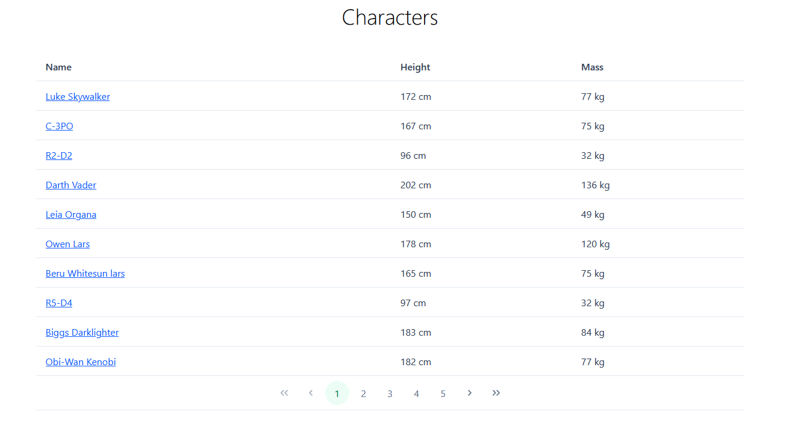

# Anzi project

This is a simple Vue 3 frontend that shows data from the Star Wars API (https://swapi.dev/)

## Requirements

- git - https://git-scm.com/
- a recent version of node.js (>20) - https://nodejs.org
- pnpm package manager - https://pnpm.io/

## How to run

- Clone this repository to your local machine
- Run `pnpm install`
- Run `pnpm run dev`
- Visit `localhost:5173`

## Major frameworks/libraries used

- Vue https://vuejs.org/ the main framework used, provides the high-level approach to building a web app as well as basic project structure.
- Vue router - for routing - https://router.vuejs.org/ - enables us to easily connect components to specific routes such as `/characters/3` or `/starships`
- axios - for making http requests to the star wars api - https://github.com/axios/axios
- Prime Vue - https://primevue.org/ - component library, so that we do not need to implement basic components such as buttons, tables, cards etc. ourselves
- TailwindCSS - https://tailwindcss.com/ - utlity css library with classes like text-center, mt-10, rounded etc.

## Project structure / directories

- `src/assets` - static assets such as images, you will also find css files here
- `src/layouts` - place for layout components
- `src/pages` - place for page components
- `src/components` - place for (most) other components
- `src/router` - vue router files/configuration
- `src/App`.vue - the root component
- `src/main`.js - entry file
